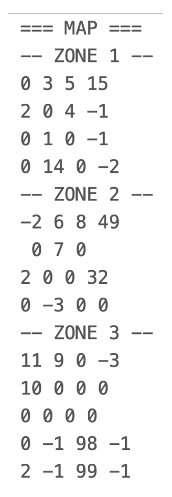
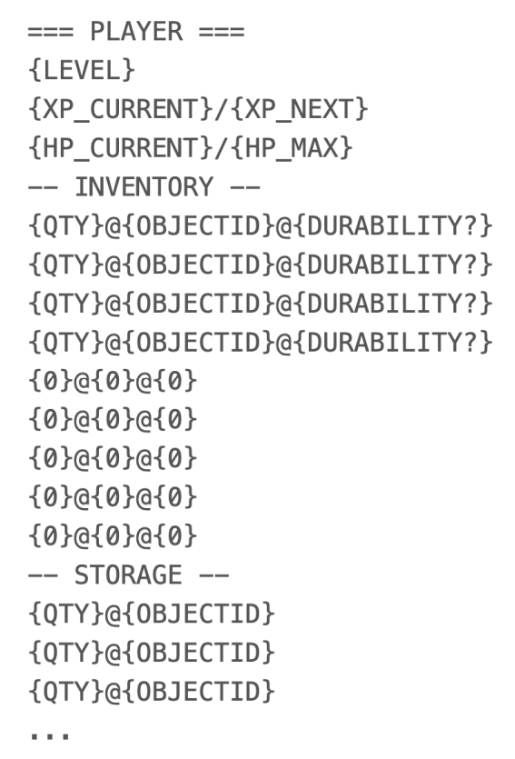

# Malloc-World Project
## Mise en route du projet
Ce projet utilise CMAKE

### Configuration de CMAKE :

windows :`cmake -B "./cmake-build-debug" -G "MinGW Makefiles"`  
linux :`cmake -B "./cmake-build-debug" -G "Unix Makefiles"`

### Utilisation de CMAKE :

Compilation : `cmake --build ./cmake-build-debug/ --target all`

### Lancer le programme :

windows : `./cmake-build-debug/Malloc-World.exe`  
linux : `./cmake-build-debug/Malloc-World`

## Utilisation de git

### Commandes de base

`git commit -a -m "{message}"` simple commit |
_toujours mettre un message et en anglais si possible !!_ 

`git add {filename}` ajoute un ficher ou dosser a git

`git push` publie ses modifs sur github

### Manipulations de branches

Pour des fonctionnalitées test ou du code qui casserai le programme, il est conseillé de créer une branche.

`git branch` affiche les branches 

`git branch {branch name}` créer une branche 

`git checkout {branch name}` change de branche 

`git merge {branch name}` fusionne 2 branches

`git branch -d {branch name}` supprime une branche

## Règles

Bienvenue à toi jeune aventurier. Me voilà à tes côtés pour te guider à travers la quête
principale de ce projet : la création du jeu Malloc World. Pour mener à bien cette quête tu
devra respecter plusieurs étapes qui te permettront de venir à bout des dangers du monde
du C.

### Partie I : Création de la map, du joueur et des déplacements en CL

C’est ici que ton aventure commence. La première étape vers la naissance de Malloc World
est la création de la carte et du personnage principal, en lui permettant de se déplacer dans
ce nouveau monde.  

1. La carte\
\
La création de la carte sera libre en respectant les critères suivants :
- La carte sera composée de 3 zones de taille différentes, accessibles ou non en
  fonction du niveau du joueur :

- La première, la zone de départ, permettra au joueur d’évoluer
  jusqu’au niveau 3.

- La seconde sera recommandée entre les niveaux 3 et 7

- La troisième sera elle proposée du niveau 7 au niveau 10.

- D’un point de vue technique, chaque zone de la carte devra être un tableau à deux
  dimensions d’entiers et chaque case représentera un élément de la zone (cf tableau
  des éléments ci-dessous). Vous allez devoir manipuler 3 tableaux 2D en fonction

- Le joueur pourra revenir dans les zones précédemment visitées grâce à l’aide des
  portails. Les portails (valeur sur la carte -2 ou -3) permettent de se déplacer et de
  changer de zone / de tableau

| Valeur | Type | Zone |
|:---|:---|:---|
| -3 | Portail entre zones II & III | 2-3 |
| -2 | Portail entre zones I & II | 1-2 |
| -1 | Case infranchissable | 1-2-3 |
| 0 | Zone libre pour se déplacer  | 1-2-3 |
| 1 | Joueur | 1-2-3 |
| 2 | PNJ | 1-2-3|
| 3 | Plante zone I | 1 |
| 4 | Rocher zone I  | 1 |
| 5 | Bois zone I | 1 |
| 6 | Plante zone II | 2 |
| 7 | Plante zone II | 2 |
| 8 | Bois zone II | 2 |
| 9 | Plante zone III | 3 |
| 10 | Rocher zone III | 3 |
| 11 | Bois zone III | 3 |
| 12 à 98 | Monstres | 1-2-3 |
| 99 | Boss de fin | 3 |

- Chaque zone devra proposer 10 ennemis ou plus, 3 rochers ou plus, 3 plantes ou
  plus et 3 arbres ou plus; A vous d’être imaginatifs !
- il serait pertinent de générer la map en procédural :)

2. Le joueur
- Le joueur aura la possibilité de posséder 3 armes (épée / lance / marteau) et 1
  plastron d’armure.

- Lorsqu’on lance une nouvelle partie, le joueur démarre au niveau 1 avec 100 points
  de vie (HP), et avec dans son inventaire une épée en bois, une pioche en bois, une
  serpe en bois et une hache en bois, lui permettant de récolter ses premières
  ressources et de combattre.

- L’inventaire du joueur est constitué de 10 emplacements. Les ressources de craft
  peuvent être empilées à hauteur de 20 maximum.

- D’un point de vue technique, le joueur est une structure qui contient son
  expérience, son niveau, ses points de vie courants et maximum ainsi que son
  inventaire.

Liste des objets pouvant être dans l’inventaire, la valeur étant le code associé :

| Valeur | Nom de l’objet | Type | Commentaire |
|:---|:---|:---|:---|
| 1 | Épée en bois | Arme | 1 dégât / 10 durabilité |
| 2 | Pioche en bois | Outil | 10 durabilité |
| 3 | Serpe en bois | Outil | 10 durabilité |
| 4 | Hache en bois | Outil | 10 durabilité |
| 5 | Sapin | Ressource de craft | 20 maximum |
| 6 | Pierre | Ressource de craft | 20 maximum |
| 7 | Herbe | Ressource de craft | 20 maximum |
| 8 | Épée en pierre  | Arme | 2 dégât / 10 durabilité |
| 9 | Lance en pierre | Arme | 3 dégât / 8 durabilité |
| 10 | Marteau en pierre | Arme | 4 dégât / 5 durabilité |
| 11 | Plastron en pierre | Armure | 10% résistance aux dégâts |
| 12 | Pioche en pierre | Outil | 10 durabilité |
| 13 | Serpe en pierre | Outil | 10 durabilité |
| 14 | Hache en pierre | Outil | 10 durabilité |
| 15 | Potion de vie I | Soin | Restaure 30 HP |
| 16 | Hêtre | Ressource de craft | 20 maximum |
| 17 | Fer | Ressource de craft | 20 maximum |
| 18 | Lavande | Ressource de craft | 20 maximum |
| 19 | Épée en fer | Arme | 5 dégâts / 10 durabilité |
| 20 | Lance en fer | Arme | 7 dégâts / 8 durabilité |
| 21 | Marteau en fer | Arme | 10 dégât / 5 durabilité |
| 22 | Plastron en fer | Armure | 20% résistance aux dégâts |
| 23 | Pioche en fer | Outil | 10 durabilité |
| 24 | Serpe en fer | Outil | 10 durabilité |
| 25 | Hache en fer | Outil | 10 durabilité |
| 26 | Potion de vie II  | Soin | 10 durabilité |
| 27 | Chene  | Ressource de craft | 20 maximum |
| 28 | Diamant | Ressource de craft | 20 maximum |
| 29 | Chanvre | Ressource de craft | 20 maximum |
| 30 | Épée en diamant | Arme | 10 dégâts / 10 durabilité |
| 31 | Lance en diamant  | Arme | 15 dégâts / 8 durabilité  |
| 32 | Marteau en diamant | Arme | 15 dégâts / 8 durabilité |
| 33 | Plastron en diamant | Armure | 40% résistance aux dégâts |
| 34 | Potion de vie III  | Soin | Restaure 200 HP |

3. Les PNJ

- Le jeu doit comporter un PNJ dans chacune des zones. Ces derniers doivent
  permettre au joueur de réparer son équipement et de gérer le crafting (cf partie III).
- Les PNJ servent également d’espace de stockage illimité au joueur. Si le joueur
  choisit l’option stockage, il aura le choix entre déposer un objet dans le coffre ou en
  retirer un.

4. Les déplacements

- Le joueur ne peut se déplacer que dans des cases vides [0] à proximité immédiate et
  en croix (haut - bas - gauche - droite). Avant chaque action, un menu devra proposer
  les différents choix qui s’offrent au joueur.

Exemple:

| <!-- --> | <!-- --> | <!-- --> |
|---|---|---|
| 0 | 3 | 0 |
| 4 | 1 | 0 |
| 0 | 2 | 0 |

  Dans cette configuration, le joueur [1] aura le choix entre se déplacer sur sa droite
  [0], interagir avec le PNJ [2], récolter une plante s’il a l’outil adéquat en état correct et
  l’espace disponible [3] ou piocher un rocher avec les mêmes conditions que pour la
  plante [4].

###Partie II : Collecte de ressources

- Lorsque le joueur collecte une ressource, la case de cette dernière redevient à l’état
  vide [0], le joueur pourra alors se déplacer sur cette case.

1. Les rochers
- Le joueur aura la possibilité de récolter des pierres (précieuses ou non) en tapant
  des rochers avec la pioche adéquate. Un rocher génère entre 1 et 4 ressources
  aléatoirement et use l’outil. Si l’outil est à 0 % il ne peut plus l’utiliser et doit le
  réparer.
- Les ressources collectées seront les suivantes :  
  zone | --> Pierre (10% d’usure) à l’aide d’une Pioche en bois ou supérieure  
  zone || --> Fer (20% d’usure) à l’aide d’une Pioche en pierre ou supérieure  
  zone ||| --> Diamant (40% d’usure) à l’aide d’une Pioche en fer

2. Le bois
- Le joueur aura la possibilité de récolter du bois en tapant des arbres avec la hache
  adéquate. Un arbre génère entre 1 et 4 ressources aléatoirement et use l’outil. Si
  l’outil est à 0 % il ne peut plus l’utiliser et doit le réparer.
- Les ressources collectées seront les suivantes :  
  zone | --> Sapin (10% d’usure) à l’aide d’une Hache en bois ou supérieure  
  zone || --> Hêtre (20% d’usure) à l’aide d’une Hache en pierre ou supérieure  
  zone ||| --> Chêne (40% d’usure) à l’aide d’une Hache en fer

3. Les plantes

- Le joueur aura la possibilité de récolter des herbes en utilisant la serpe adéquate.
  Une plante génère entre 1 et 4 ressources aléatoirement et use l’outil. Si l’outil est à
  0 % il ne peut plus l’utiliser et doit le réparer.
- Les ressources collectées seront les suivantes :  
  zone 1 --> Herbe (10% d’usure) à l’aide d’une Serpe en bois ou supérieure  
  zone 2 --> Lavande (20% d’usure) à l’aide d’une Serpe en pierre ou
  supérieure  
  zone 3 --> Chanvre (40% d’usure) à l’aide d’une Serpe en fer

**La fréquence de réapparition des ressources dans une zone est de 10 tours. (10
actions de l’utilisateur sur la carte). Si le joueur se trouve sur la case à ce moment, la
ressource réapparaît au tour suivant.**

###Partie III : Le craft & les réparations

- Le joueur a la possibilité de créer des armes et des potions à l’aide des ressources
  collectées auprès des PNJ. La rareté des items dépendra du niveau des ressources.

| Objet | Ressources | Zone PNJ |
|---|---|---|
| Épée en bois | 3 sapin | 1-2-3 |
| Épée en pierre | 2 sapin - 3 pierres | 1-2-3 |
| Épée en fer | 2 hêtre - 4 minerais de fer | 2-3 |
| Épée en diamant | 2 chêne - 5 minerais de diamant | 3 |
| Lance en pierre | 3 sapin - 4 pierres  | 1-2-3 |
| Lance en fer | 3 hêtre - 5 minerais de fer  | 2-3 |
| Lance en diamant | 3 chêne - 6 minerais de diamant | 3 |
| Marteau en pierre | 2 sapin - 6 pierres | 1-2-3 |
| Marteau en fer | 2 hêtre - 7 minerais de fer  | 2-3 |
| Marteau en diamant | 2 chêne - 8 minerais de diamant | 3 |
| Plastron en pierre | 10 pierres | 1-2-3 |
| Plastron en fer | 12 minerais de fer | 2-3 |
| Plastron en diamant | 16 minerais de diamant | 3 |
| Pioche en bois | 3 sapin | 1-2-3 |
| Pioche en pierre | 2 sapin - 3 pierres | 1-2-3 |
| Pioche en fer | 2 hêtre - 4 minerais de fer | 2-3 |
| Hache en bois | 3 sapin | 1-2-3 |
| Hache en pierre | 2 sapin - 3 pierres | 1-2-3 |
| Hache en fer | 2 hêtre - 4 minerais de fer | 2-3 |
| Serpe en bois  | 3 sapin | 1-2-3 |
| Serpe en pierre | 2 sapin - 3 pierres | 1-2-3 |
| Serpe en fer | 2 hêtre - 4 minerais de fer | 2-3 |
| Potion de vie I | 2 plantes de zone I | 1-2-3 |
| Potion de vie II | 2 plantes de zone II | 2-3 |
| Potion de vie III | 2 plantes de zone III | 3 |

- Les réparations sont effectuées gratuitement et remettent toutes les armes et outils
  au maximum de leur durabilité.

###Partie IV : Levelling & combat

1. Le levelling

- A chaque gain de niveau, le joueur augmentera également ses points de vie
  maximum et ses derniers seront restaurés à 100%.  
  Niveau 2 : + 10 HP  
  Niveau 3: + 20 HP  
  Niveau 4 : + 30HP  
  Niveau 5: + 40 HP  
  Niveau 6 à niveau 8: + 50HP  
  Niveau 9 et 10: + 75HP  

- Le joueur gagne de l’expérience en tuant des monstres. L’expérience générée par
  chaque combat est laissée à votre appréciation mais devra être proportionnelle.

- Lorsque le joueur atteint le niveau nécessaire, le portail vers la zone suivante est
  débloqué

2. Les combats

- Les différents monstres générés sont laissés à votre appréciation. Vous avez les
  plages de 12 à 98 réservées sur la carte à cet effet, la 99ème représentant le boss
  de fin. Pensez à créer un minimum de 3 monstres par zone, avec des points de vie
  et des dégâts différents;

- Chaque type de monstre aura un un numéro associé (12 - 98), le nom ainsi que les
  dégâts et l’expérience du combat devra être de votre choix pour chaque monstre.
  D'un point de vue programmation, le monstre doit être une structure.

- Avant chaque combat, le joueur devra choisir une arme s’il en possède plusieurs
  dans son inventaire courant.

- Avant chaque tour, le joueur aura la possibilité d’utiliser une potion, d’attaquer ou de
  fuir (taux de réussite de 30%). Après chaque action du joueur, ce sera au tour du
  monstre, jusqu’à la mort d’un des deux adversaires.

- Chaque coup porté enlève 1 de durabilité à l’arme. Cet état devra être conservé à la
  fin du combat.

- Si le joueur meurt, le jeu s’arrête et reprend au début. Si le monstre meurt, le joueur
  gagne de l’expérience et la case sur laquelle il se trouvait repasse à l’état vide [0].

**La fréquence de réapparition des monstres dans une zone est de 15 tours. (15 actions
de l’utilisateur sur la carte). Si le joueur se trouve sur la case à ce moment, le monstre
réapparaît au tour suivant.**

###Partie V : Sauvegarde & restauration du jeu

La sauvegarde du jeu devra se faire dans un fichier texte et devra respecter la nomenclature
suivante:  

1. Carte:

3. Joueur, inventaire et coffre de stockage:

   Lors de l’enregistrement, le nom des variables devront être remplacées par les
   valeurs associées (OBJECTID correspondant à la valeur dans le tableau d’inventaire
   de la partie I)  
   La durabilité est optionnelle, si l’objet ne possède pas de durabilité mettre 0.  
   Si les emplacements de l’inventaire sont vides, mettre toutes les informations à 0

Il devra également être possible de charger une partie depuis un fichier de sauvegarde
respectant ce format.

###Partie VI : Interface graphique

La partie CLI et la partie interface graphique doivent proposer deux exécutables différents.

Rendre le jeu jouable en 2D grâce à une interface graphique créée avec SDL. Vous pouvez
laisser libre court à votre imagination pour les visuels… surtout pour le boss de fin !

